Recently, I got interested in email services. You know those emails with a custom domain like "john@github.com", yeah I want to get one of those for my domain ([rickyxyz.dev](https://rickyxyz.dev)). I know there are services like [Google Workspace](https://workspace.google.com) or [Zoho Mail](https://www.zoho.com) that allows you to use a custom domain for your email address, but I am a techie, of course I can't just the simple solution and I need to engineer one myself. So, I tried to connect [AWS SES](https://aws.amazon.com/ses/) with my Gmail client.

## Contents

- [Expected Results](#expected-result)
- [Requirements](#requirements)

## Expected Results

By the end of this process, I hoped I could (and you too):

1. Send an email from my custom domain through Gmail client
2. Receive an email sent to my custom domain's email
3. Read email sent to my custom domain using Gmail client

## Requirements

What you need to get started:

1. A domain (and access to change its DNS records) (my domain is registered with Cloudflare in this case)
2. A AWS account/user with access to AWS SES, S3, and Lambda
3. A Gmail account (for the Gmail client)

> Before you use/create any service in your AWS account, make sure your AWS is set to the right region.

## Connect Your Domain with AWS SES

AWS SES can only send an email from domain that is registered and verified in the SES identities list.

1. Add your domain to AWS SES Identities

   In the AWS SES dashboard, go to the 'identities' tab and create a new identity.

   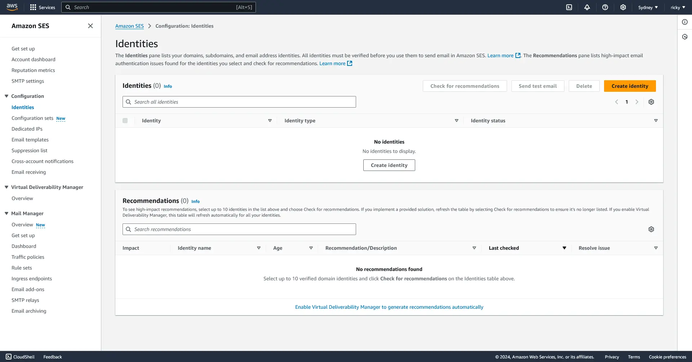

   Input your domain name, and check the custom MAIL FROM domain and input a your subdomain.

   

   If your domain is registered with AWS Route53, you should probably check the publish DNS records to Route53 to let AWS update the domain record automatically. I skipped the advanced DKIM settings and the tags information. Afterward you should be taken to this screen.

   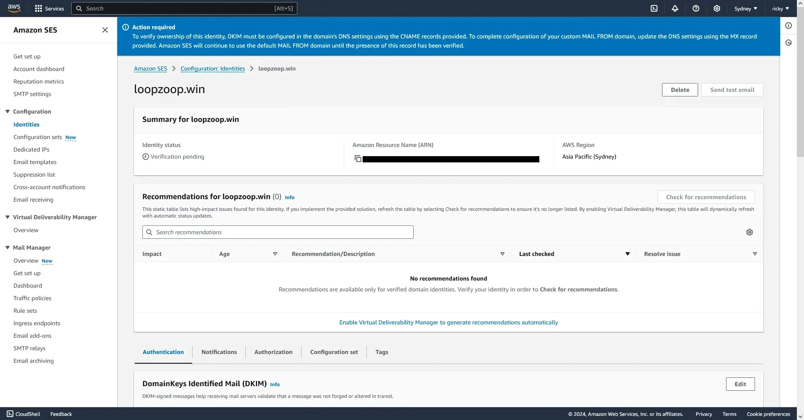

2. Updating your DNS record
   From the previous screen, scroll down and you will find the DNS record you need to put to your domain's DNS configuration. My domain is registered with Cloudflare, but as long as you have access to change the DNS record, any domain registrars should work. You will need to add 3 groups of DNS record to your DNS record: [DKIM](https://en.wikipedia.org/wiki/DomainKeys_Identified_Mail) records, [MAIL FROM](https://docs.aws.amazon.com/ses/latest/dg/mail-from.html) record, and [DMARC](https://en.wikipedia.org/wiki/DMARC) record. I am going to assume you won't have any problem with adding the DNS record to your domain, but here is the [AWS Guide](https://docs.aws.amazon.com/ses/latest/dg/creating-identities.html#just-verify-domain-proc) if you need it.

   The only thing you might need to watch out for is probably the MX record value. You see the '10' in the MX record value, that is not part of the value but the MX record priority;

   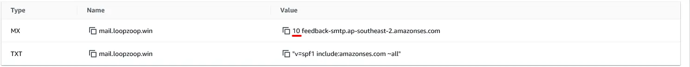

   Make sure you do not insert the '10' into the record value, but insert it into the MX record priority like so.

   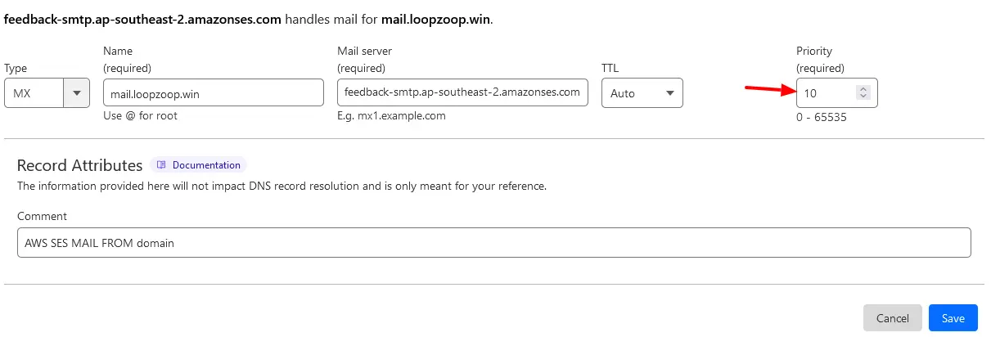

3. Check back to AWS SES
   After you updated your DNS records, give it a while and check back to AWS SES, if everything went alright you should see identity status verified.

   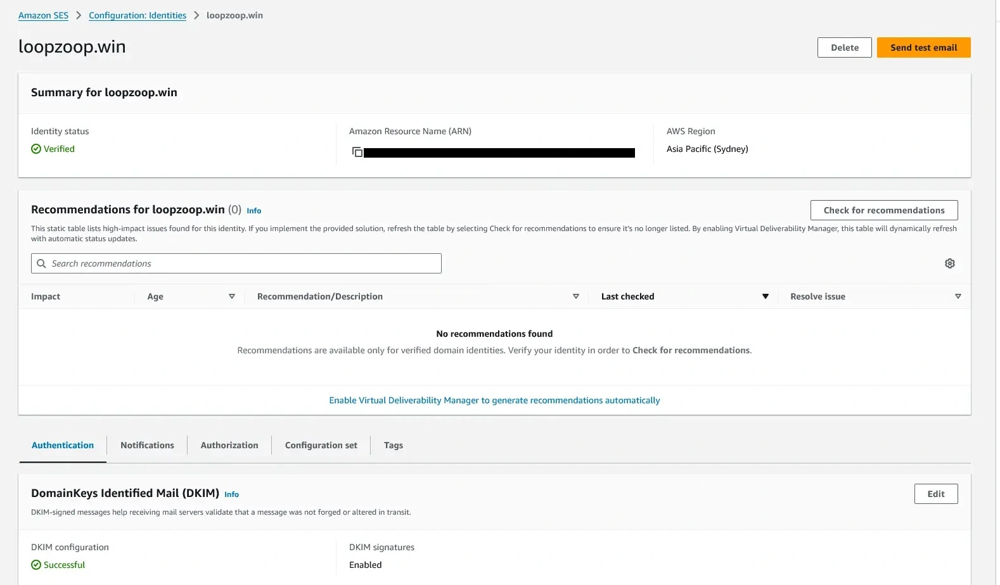

## Setup Email Receiving

Your domain is now registered with AWS SES, but you cannot receive or send email yet. To receive emails on AWS SES, you need to once again update your DNS record. [AWS Documentation Page](https://docs.aws.amazon.com/ses/latest/dg/receiving-email-mx-record.html)

1. Adding an MX record for email receiving to your domain

   Add another MX record to your DNS record. Insert the root domain name as the MX record's name and insert the value.

   `inbound-smtp.region.amazonaws.com`

   You can find the region value from the region selector on the top bar in AWS.

   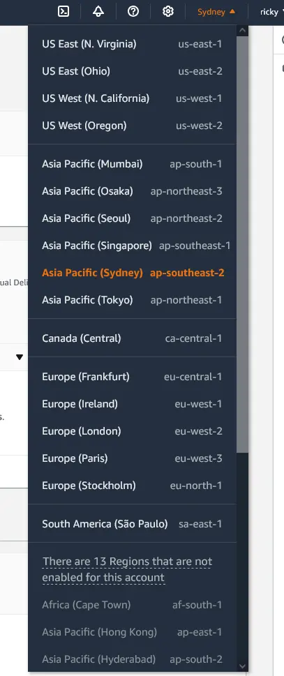

   replace the region with your AWS SES region, and you're supposed to set the priority to 10, but I set it to 20 to avoid possible conflict with the other MX record.
   So in my case it looks like this in Cloudflare.

   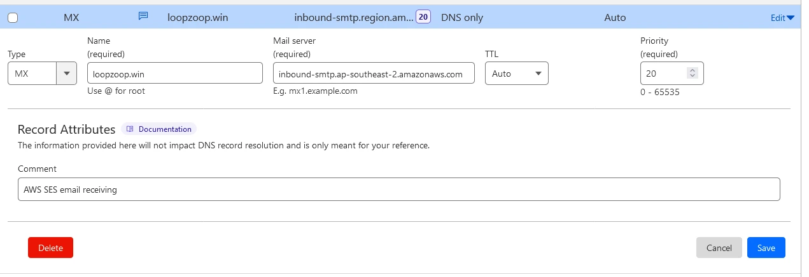

2. Receive and store email to S3 bucket

   Open the Email Receiving dashboard on SES and create a new rule set. Name it something you will understand when you read it later.

   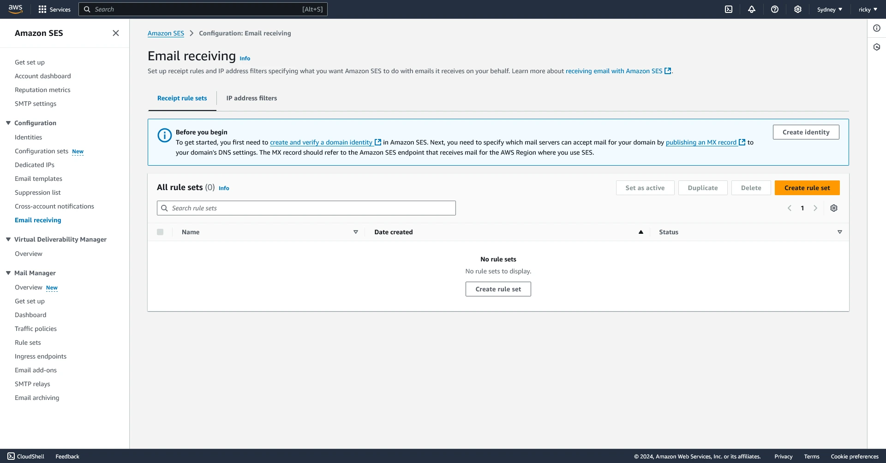

   In the rule set create a new rule, and name it clearly. The TLS and virus scan options are up to you. Then fill the recipient conditions with the address you want SES to handle for you. For example if you want to send every email addressed to "admin@yourdomain.com" to an S3 bucket, you would add "admin@yourdomain.com" to the recipient conditions. In the next step add a new action to deliver to S3 bucket, and pick an S3 bucket or create a new one. For now disable the message encryption.

   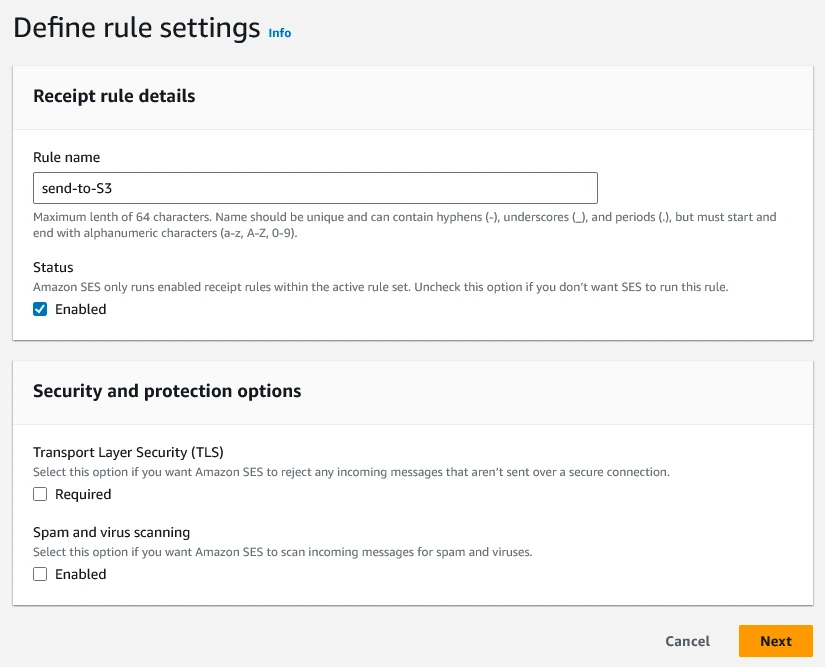

   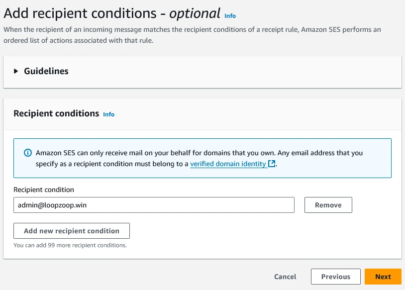

   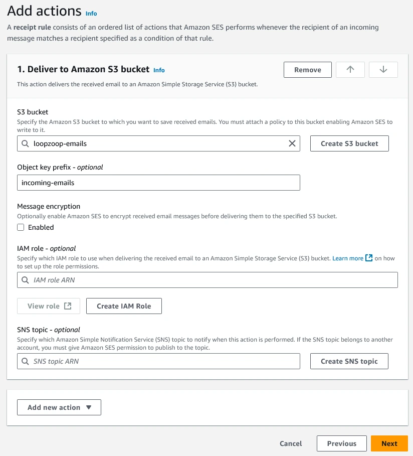

   Finish the rule creation and make sure the ruleset is enabled.

   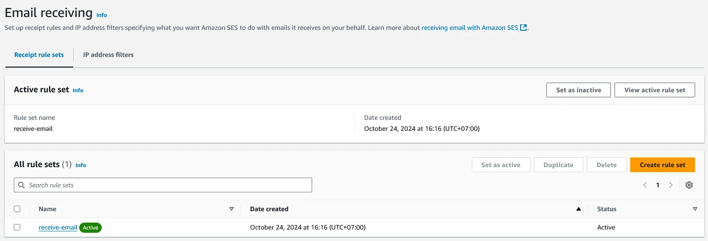

3. Test the receiving setup

   Now you should be able to receive and view email sent to AWS SES. Try sending an email from your Gmail to one of your SES recipient value. If everything is setup correctly, you should see a new entry in the S3 bucket you selected in the previous step.

## Setup AWS Lambda to Forward Email to Your Gmail

> If your SES is still in sandbox mode, you may need to add your email to AWS SES Identities so AWS SES can send to your email.

Now that AWS SES can store your email to S3 bucket, the next step is to forward that email to your Gmail address, so you can read emails sent to you in your Gmail.

1. Go to AWS Lambda and create a new function using node 20.x or node 18.x
   For the function body, I used a slightly modified code from [AWS Lambda SES Forwarder by Joe Turgeon](https://github.com/arithmetric/aws-lambda-ses-forwarder).
   To make the code works with Node 20.x, change the Lambda file extension from 'index.mjs' to 'index.js',

   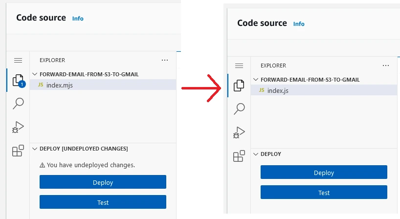

   The code I used is in this [GitHub Gist link](https://gist.github.com/rickyxyz/85b60cf16404fd86e3a7169b78691427)

   <script src="https://gist.github.com/rickyxyz/85b60cf16404fd86e3a7169b78691427.js"></script>

   Also, don't forget to change the defaultConfig values to match yours. Please read the comment on top of the variable for information about each field value.

   > For the fromEmail, you may need to set it to your FROM EMAIL subdomain address.

   ```js
   var defaultConfig = {
     fromEmail: "admin@mail.loopzoop.win",
     subjectPrefix: "",
     emailBucket: "loopzoop-emails",
     emailKeyPrefix: "incoming-emails/",
     allowPlusSign: true,
     forwardMapping: {
       "admin@loopzoop.win": ["your_email@gmail.com"],
     },
   };
   ```

2. Set up Lambda permission to use S3 and SES

   After setting up the Lambda function, you will need to allow that Lambda instance to access S3 to read the email data and access to SES to send raw email. Go to the configuration tab and go to the permission section. Click on the role name to get redirected to IAM.

   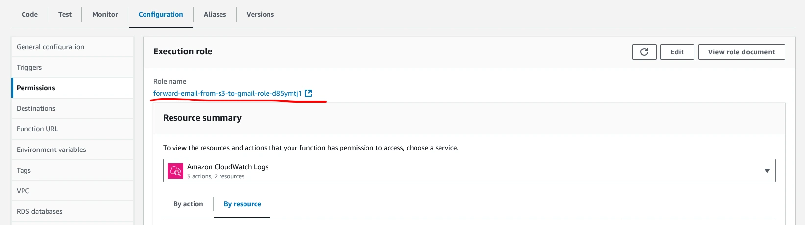

   In the IAM create a new inline policy.

   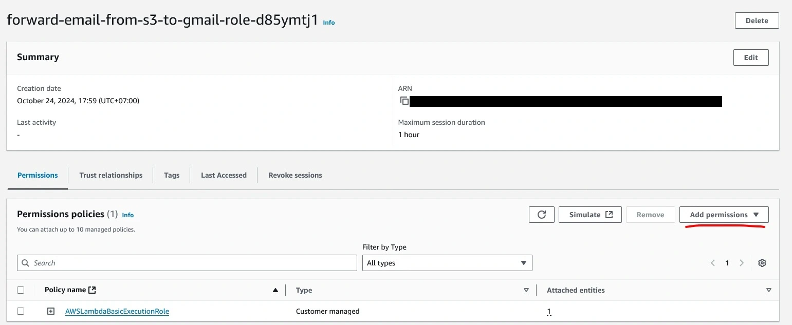

   There are two ways to create the policy, using a visual editor or a JSON editor. I am using the visual editor for this. First add S3 to the services and add persmission for 'GetObject' and 'PutObject'.

   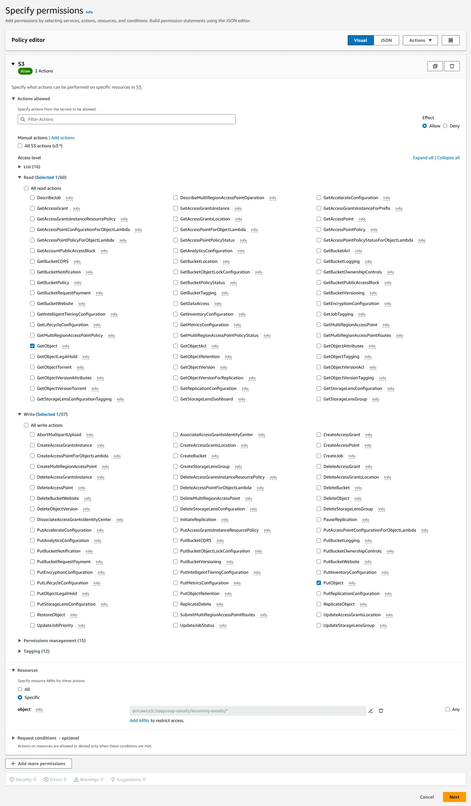

   Then for the resources, limit the access to only the specific S3 bucket that stores the incoming SES email, make sure there is a wildcard ('\*') to the end of the ARN string.

   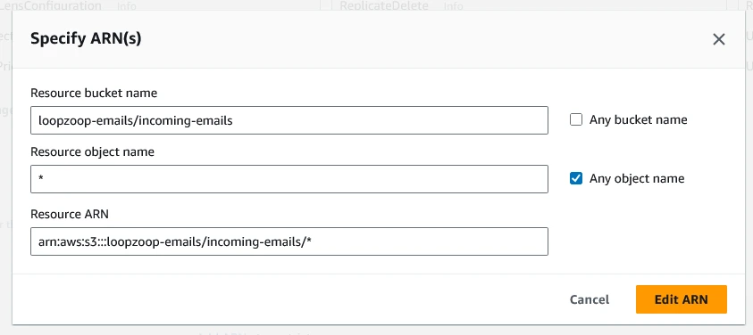

   Then add SES to the services list and add the 'SendRawEmail' permission,

   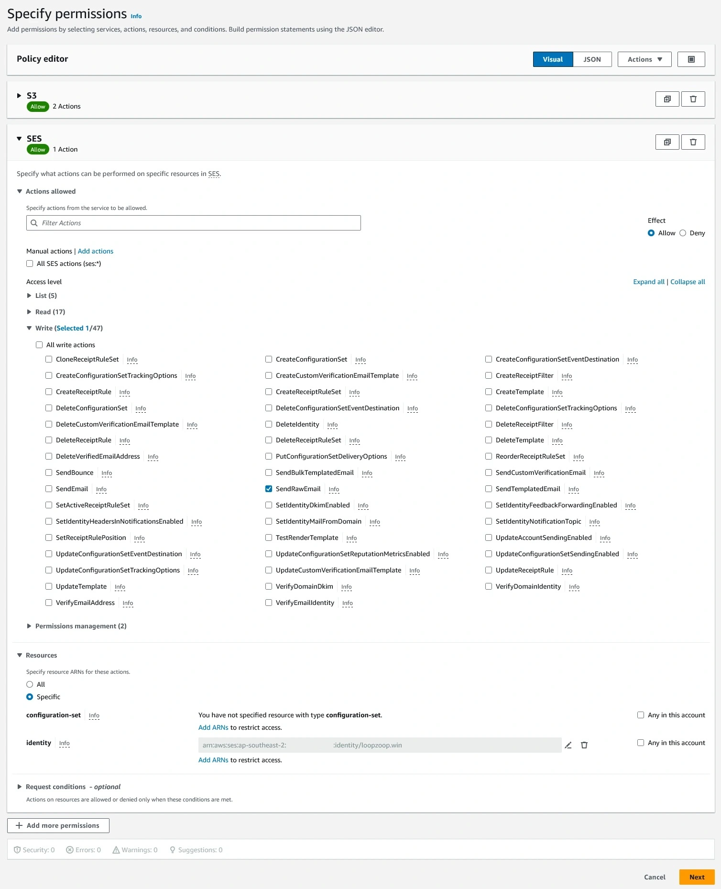

   for the resources limit the access to your specific AWS SES identity.

   > You can find the ARN string for your SES identity in the Identities dashboard in SES
   > 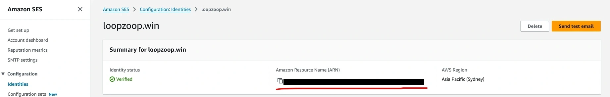

   Review and save your changes.

3. Add Lambda invocation to the SES receiving rule action
   After creating the Lambda function and adding the necessary permission, go back to SES receiving rule and edit the existing rule to add an action to it. Add the Lambda function you just created, then save it.

   

   > At this point AWS may ask you to grant persmission for SES to access the Lambda resource

4. Test the email forwarding
   Now if I didn't miss any step while writing this, any email you send to your AWS SES address will be forwarded to the email of your choice.

   > If your SES is still in sandbox mode, you will need to add your personal email to SES Identity. In sandbx mode SES will not send email to address that is not in the identity list

## Setup SMTP Receive email from Gmail

Now (hopefully) your SES instance could receive and forward emails to your Gmail. The next step is to setup SMTP between SES and your Gmail client, so you can send email using your custom domain from Gmail. This part should be the easiest.

1. Create a new SMTP credentials

   Go to SMTP settings in your SES dashboard and create a new SMTP credentials. Again, name it something clear that you will understand later.

   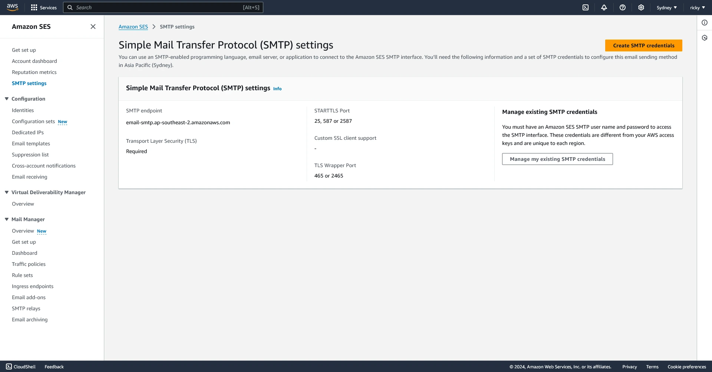

   Make sure to download the SMTP credential .csv file.
   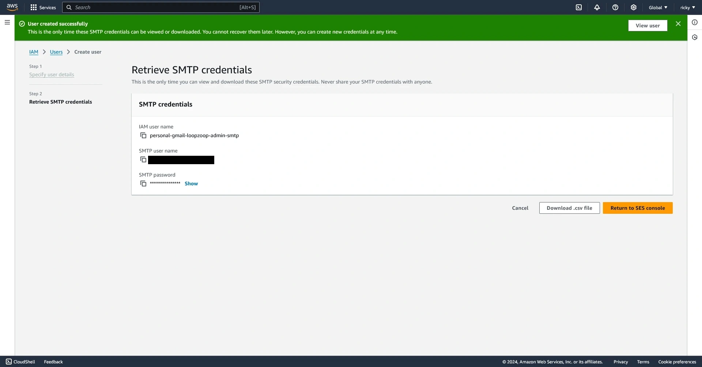

2. Input your SMTP details to your Gmail client

   In Gmail web, go to settings and open up all settings and open the 'Accounts and Import' section.

   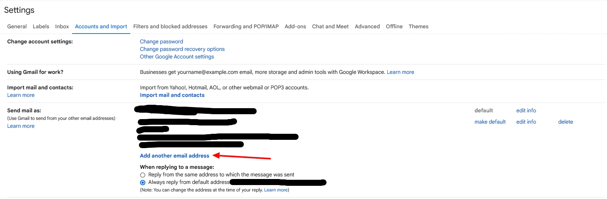

   A new popup window will show up, in the popup window fill all fields needed.
   The email address, is the address where the email will be sent from.

   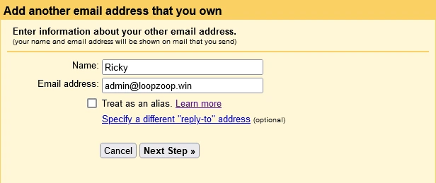

   Then fill up the rest of the fields with details of your SMTP credentials.

   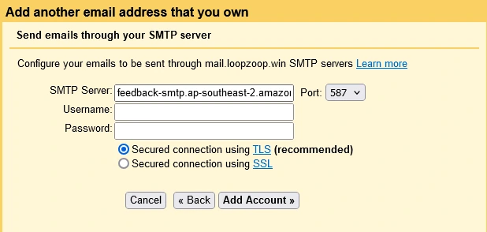

3. Verify your email

   After filling up all the details, now Google should send a verification email to your SES. If the previous steps are working, the verification email should be forwarded to your Gmail inbox (please check your spam folder, it might end up there) or you can just directly check from your S3 bucket content.

4. Try sending out an email

   Now try sending out an email using your custom domain address. You should probably try sending an email to an account you own first to make sure everything is working.

   > If your SES is still in sandbox mode, you need to add the email you want to send to to the SES Identities list.

## Summary

Hopefully now you shold be able to send and receive email using your custom domain through Gmail using SES.

If there any steps I missed or something is wrong with these steps, please leave a comment, and I will try to amend this post.

~ Thank you for reading
